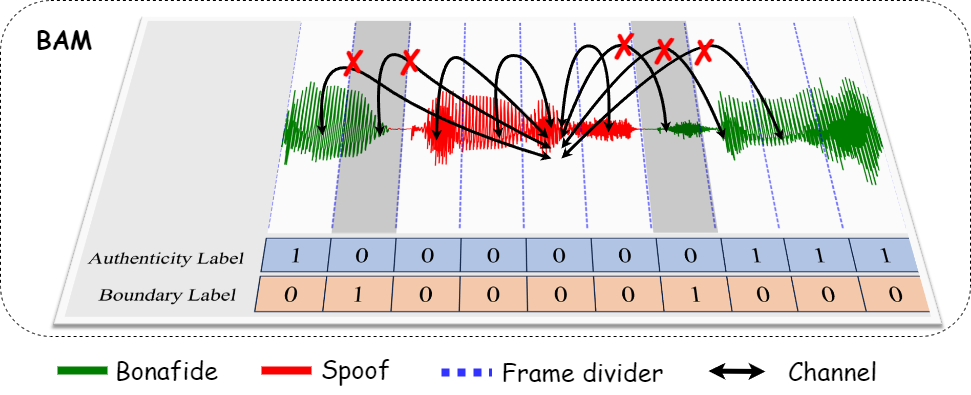

# BAM

[](https://zenodo.org/doi/10.5281/zenodo.12747416)

This is the pytorch implementation of our work [Enhancing Partially Spoofed Audio Localization with Boundary-aware Attention Mechanism]().




# Enviroment

Our training code is base on [Pytorch-lightning](https://lightning.ai/docs/pytorch/stable/). we need install following dependency firstly.

```python
conda create -n bam python=3.8
conda activate bam
pip install torch
pip install lightning==2.1 pytorch-lightning==2.1
pip install scikit-learn
pip install s3prl
pip install librosa
pip install tensorboard
```
# Usage
## Data preparation
Change the partialspoof_path in [ps_preprocess.py](/dataset/ps_preprocess.py) to your PartialSpoof dataset path and run this python file.
The ps_preprocess.py is to extract boundary label for segment-level label. 
```python
python dataset/ps_preprocess.py
```
## Training
Run the default configuration with WavLM pre-trained model.
```python
python train.py 
```

## Evaluation
we also provide checkpoint in ./checkpoint/model.ckpt. Please download the modl checkpoint file from [Google driver](https://drive.google.com/file/d/1eL3Ca27hEruI20lkoqkQEnZlb2GzTyHT/view?usp=sharing). The evaluation may take some times.
```
python train.py --test_only --checkpoint ./bam_checkpoint/model.ckpt
```

Please feel free to contact us if there is anything we can do to support your work.

# Citation
If you use this code and result in your paper, please cite our work as:
```
@article{zhongbam2024,
  title={Enhancing Partially Spoofed Audio Localization with Boundary-aware Attention Mechanism},
  author={Jiafeng, Zhong and Bin, Li and Jiangyan, Yi},
  year={2024}
}
```

